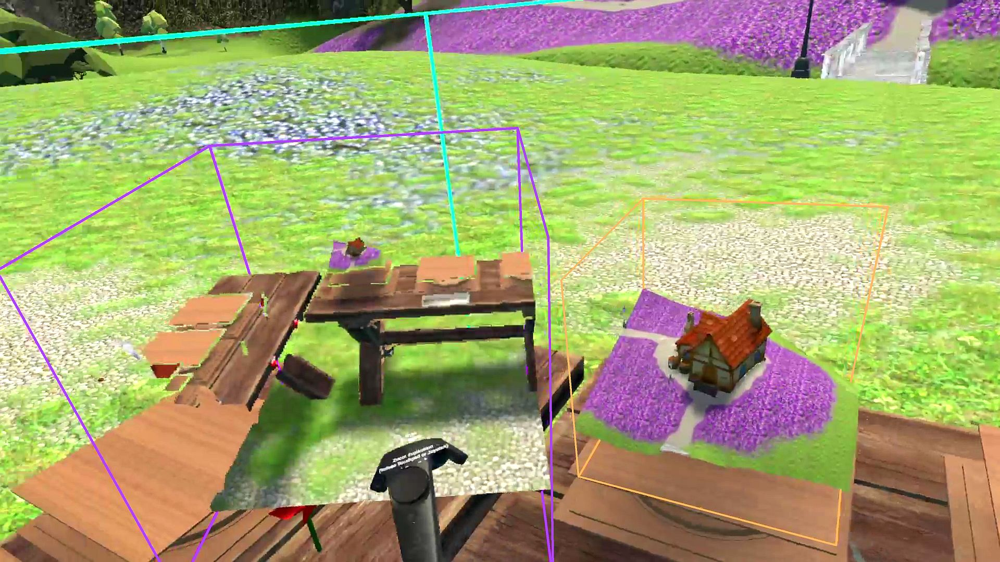
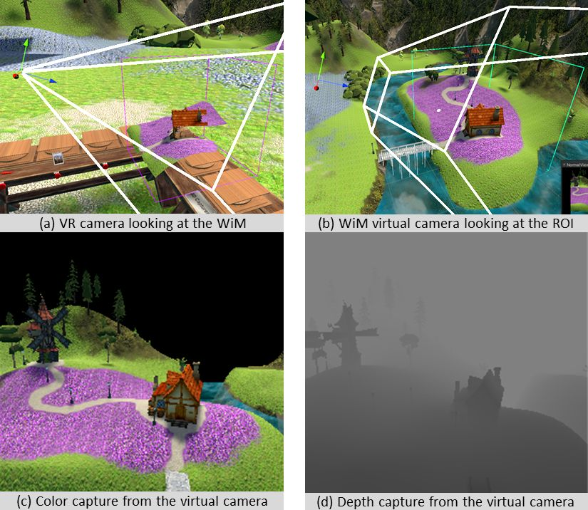
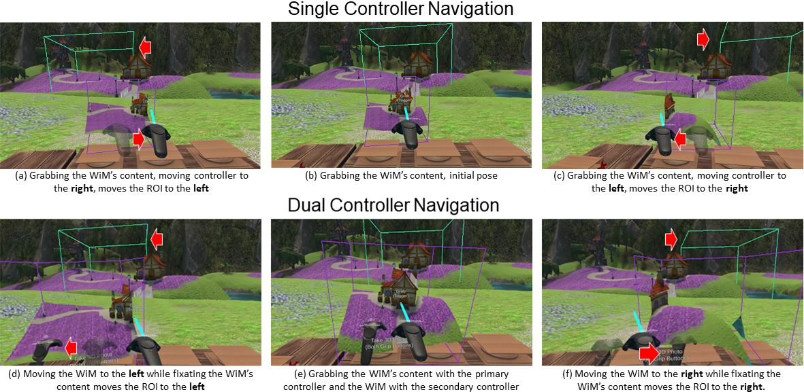

# Spatial Exploration with a WiM for Capturing 3D Dioramic Snapshots
Submitted and accepted to the IEEE VR 2022 3DUI Contest (https://ieeevr.org/2022/contribute/3dui-contest/)<br/>
You can find the demo executable for the conference here:<br/>
https://docs.google.com/presentation/d/1uXK1lr8Uz53kP6QKXu8H1L-fJjVvjcBoEIG3aYj7INo/edit?usp=sharing

## Abstract

Immersive Virtual Reality can be a memorable medium for story-telling and artistic expression. However, taking snapshots of VR applications is commonly only possible by taking a two-dimensional screenshot on a tethered PC. We capture 3D snapshots using the interaction technique World-In-Miniature (WiM) by using virtual RGB-D cameras to create three-dimensional snapshots that can be exported and viewed outside the application.<br/>
We integrate a novel interaction method to fine-tune the content shown inside the WiM with VR controllers. 

## Features
This project uses the principle of World-In-Miniature for Spatial Exploration, fine-adjustment of pose and scale of the region on interest, and creating 3D snapshots. Latter can be stored into .obj Wavefront files with exported textures.

### World-in-Miniature
The WiM is defined by positioning the wireframe box of the region of interest (roi) to 3D geometry such that it fully encapsulates the preferred area. The script ```Mag_Root.cs``` creates the necessary 3D boxes of the WiM and the roi.
For capturing the scene within the roi, an additional script needs to be deployed which holds one or more instances of ```mag_RGBD.cs```. We provide an example under ```Magnorama/MinimalExample/MinimalExample.cs``` and ```Example/3DUI_Scene/Scripts/Snapshot3DUI_Main.cs```.
<p align="center">
	
</p>
Internally, the algorithm creates a virtual color+depth camera that acquires the geometry and texture from a viewpoint. Therefore, it requires that objects which the user wants to snapshot to be visible inside the depth buffer. For now, this excludes particles and some transparent materials.
The acquired depth and color image of the virtual RGB-D camera is converted into an ordered, triangulated point cloud inside a compute shader and rendered into the VR view.

### Interaction
This project integrates interaction methods for positioning the roi from within the WiM and its scripts and prefabs can be found inside the folder ```Magnorama/Interaction/```. The example ```/Example/3DUI_Scene/3DUI_Scene.unity``` provides a demonstration which was tested with a Vive Pro and two standard Vive controllers.
<p align="center">
	
</p>
We designate one controller to interact with the roi and any content displayed inside the WiM. This controller can be identified by the blue ray coming from the tip of the controller.
The second controller controls the WiM, where pressing the trigger allow the user to grab it.
Both controllers can scale up and down their box by drawing circles onto the touchpad of the controller.

## Contact
This project is developed by Kevin Yu, employed by the Technical University of Munich, Germany.<br/>
Please contact me with my e-mail kevin.yu(at)tum.de for questions, opportunities, and feedback.

### Licensing and 3rd Party Libraries

The provided code in the folder of "Assets/Magnoramas" is open-source; however, 3rd party libraries provided for the example scene is NOT and follow their regulations.
The following assets has been used for the project and can be acquired free from the Unity Asset store:
- SteamVR Plugin (https://assetstore.unity.com/packages/tools/integration/steamvr-plugin-32647)
- MicroSplat (https://assetstore.unity.com/packages/tools/terrain/microsplat-96478)
- Stylize Water Texture (https://assetstore.unity.com/packages/2d/textures-materials/water/stylize-water-texture-153577)
- Low Poly Tree Pack (https://assetstore.unity.com/packages/3d/vegetation/trees/low-poly-tree-pack-57866)
- Medieval Windmill (https://assetstore.unity.com/packages/3d/medieval-windmill-89489)
- Animal Monster - Eagle (https://assetstore.unity.com/packages/3d/characters/animal-monster-eagle-202286)
- White Rabbit (https://assetstore.unity.com/packages/3d/characters/animals/white-rabbit-138709)
- Fish - PolyPack (https://assetstore.unity.com/packages/3d/characters/animals/fish/fish-polypack-202232)
- Swamp Bridge (https://assetstore.unity.com/packages/3d/props/exterior/swamp-bridge-71515)
- Raw Wooden Furniture Free (https://assetstore.unity.com/packages/3d/props/furniture/raw-wooden-furniture-free-166329)
- Skybox Series Free (https://assetstore.unity.com/packages/2d/textures-materials/sky/skybox-series-free-103633)
- Fireworks (https://assetstore.unity.com/packages/3d/props/weapons/fireworks-101035)

and miscellaneous models:
- Carrot (https://www.turbosquid.com/3d-models/free-carrot-3d-model/441434)
- Pin wheel (https://www.cgtrader.com/free-3d-models/sports/toy/pinwheel)

and sound effects from https://freesound.org/home/

________________________________________________________________________________________________________________
Cite us!
```
@article{yu2022spatial,
  title={Spatial Exploration with a WiM for Capturing 3D Dioramic Snapshots},
  author={Yu, Kevin and Eck, Ulrich and Navab, Nassir},
  booktitle={2022 IEEE Virtual Reality and 3D User Interfaces (VR), 3DUI Contest},
  organization={IEEE}
}
```

You may be interest for our related work:

```
@article{yu2022duplicated,
  title={Duplicated Reality for Co-located Augmented Reality Collaboration},
  author={Yu, Kevin and Eck, Ulrich and Pankratz, Frieder and Lazarovici, Marc and Wilhelm, Dirk and Navab, Nassir},
  journal={IEEE Transactions on Visualization \& Computer Graphics},
  number={01},
  pages={1--1},
  year={2022},
  publisher={IEEE Computer Society}
}
```

```
@inproceedings{yu2021magnoramas,
  title={Magnoramas: Magnifying Dioramas for Precise Annotations in Asymmetric 3D Teleconsultation},
  author={Yu, Kevin and Winkler, Alexander and Pankratz, Frieder and Lazarovici, Marc and Wilhelm, Dirk and Eck, Ulrich and Roth, Daniel and Navab, Nassir},
  booktitle={2021 IEEE Virtual Reality and 3D User Interfaces (VR)},
  pages={392--401},
  year={2021},
  organization={IEEE}
}
```
________________________________________________________________________________________________________________
Copyright 2022 Kevin Yu

This program is free software; you can redistribute it and/or
modify it under the terms of the GNU General Public License
version 2 as published by the Free Software Foundation.

This program is distributed in the hope that it will be useful,
but WITHOUT ANY WARRANTY; without even the implied warranty of
MERCHANTABILITY or FITNESS FOR A PARTICULAR PURPOSE. See the
GNU General Public License for more details.
